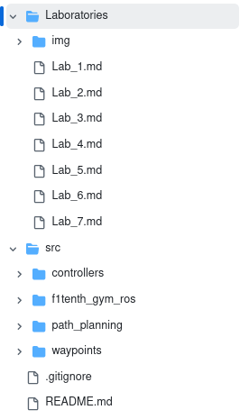
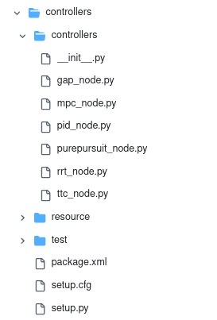
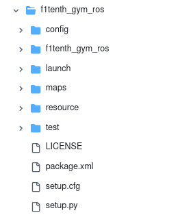
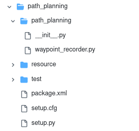
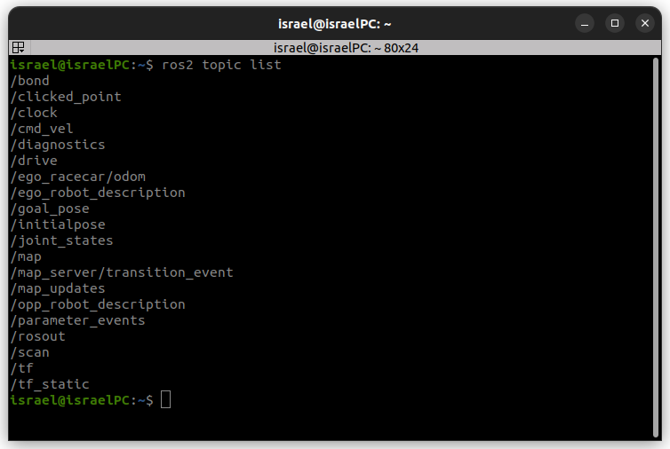
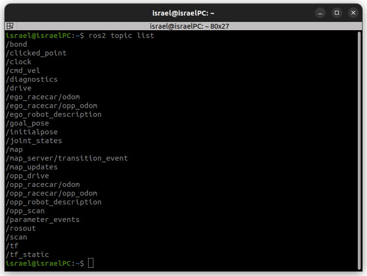

# Simulador de F1TENTH para las competencias de vehiculos autonomos
El simulador de F1TENTH para ROS 2 es un entorno de simulación diseñado para probar algoritmos de control, navegación y planificación en un vehículo autónomo a escala 1/10.

**Características del simulador F1TENTH en ROS 2**
- Publica y suscribe tópicos en ROS 2, permitiendo interacción con sensores virtuales y actuadores del robot.
- Simula sensores como LIDAR y odometría.
- Compatible con algoritmos de navegación autónoma.
- Permite el uso de 1 o 2 vehiculos simultaneamente.

## 1. Instalacion del simulador

#### 1.1. Instalacion de dependencias y simulador
- **ROS 2 Humble**: Siga las instrucciones [aqui](https://docs.ros.org/en/humble/Installation/Ubuntu-Install-Debs.html), para instalarlo.
- **F1TENTH Gym**
  ```bash
  git clone https://github.com/f1tenth/f1tenth_gym
  sudo apt install python3-pip
  cd f1tenth_gym && pip3 install -e .
  ```

**Instalacion del simulador:**

Clonar el repositorio en la computadora:
```bash
cd $HOME
git clone https://github.com/widegonz/F1Tenth-Repository.git
```

https://github.com/user-attachments/assets/984a755c-6259-4271-9f88-51f68e425af5

#### 1.2. Instalacion de dependencias del simulador

Las dependencias se instalan con rosdep:
```bash
cd
sudo apt install python3-rosdep2
rosdep update
source /opt/ros/humble/setup.bash
cd ~/F1Tenth-Repository
rosdep install -i --from-path src --rosdistro humble -y
```

https://github.com/user-attachments/assets/4c3ea5fb-4486-459f-beb7-bb7e8efa2a34

#### 1.3. Actualizar el parámetro correcto para la ruta al archivo del mapa

Para asegurarnos de que el simulador logra encontrar correctamente los mapas, debemos modificar la ruta que viene por defecto en el archivo `sim.yaml`, la cual es la siguiente:

`/home/your_user/F1Tenth-Repository/src/f1tenth_gym_ros/maps/levine`

En este caso, se reemplazará la parte que dice `your_user` y se va a escribir el nombre de usuario que se haya definido en nuestra computadora. El proceso para realizar esto es el siguiente:

https://github.com/user-attachments/assets/f66baff8-8d29-4306-a2e5-d5a50eb888f3

Con el path modificado, solo tenemos que dirigirnos a la carpeta principal y realizar la compilacion de nuestro espacio de trabajo.

```bash
cd ~/F1Tenth-Repository
colcon build
```

#### 1.4. Iniciar la simulacion

Para iniciar la simulacion, debemos asegurarnos de haber hecho source a nuestro espacio de trabajo
```bash
cd ~/F1Tenth-Repository
source install/setup.bash
```

Luego usamos el siguiente comando para cargar el simulador:

```bash
ros2 launch f1tenth_gym_ros gym_bridge_launch.py
```

La primera vez que ejecutamos el comando, el simulador va a demorar un poco en cargar el modelo del robot, las proximas veces se iniciará mas rapidamente.

https://github.com/user-attachments/assets/1791be99-73b6-4a22-acc2-6efa6fd40e5f

## 2. Estructura del Repositorio

El repositorio proporcionado fue desarrollado a partir de las diferentes tareas que se pueden llevar a cabo dentro del simulador, a su vez, se agrego informacion util de practicas, que los creadores de la competencia proporcionan para ir aprendiendo aspectos importantes de la navegacion autonoma.

<p align="center">
  
  <br />
  <em>Contenido del Repositorio</em>
</p>

#### 2.1. Carpeta `Laboratories`

Dentro de esta carpeta se incluyen practicas que los desarolladores de la competencia proporcionan con el objetivo de que los estudiantes aprendan sobre el uso del simulador y el robot real. Se tienen un total de 7 practicas, correspondientes a los siguientes temas:
- Laboratorio 1: Introduccion a ROS 2
- Laboratorio 2: Freno de Emergencia Automatico
- Laboratorio 3: Seguidor de Muro (Algoritmo de Control)
- Laboratorio 4: Follow the Gap (Algoritmo de Control)
- Laboratorio 5: Pure Pursuit (Planificación de Movimiento)
- Laboratorio 6: Rapidly-exploring Random Tree (RRT)
- Laboratorio 7: Model Predictive Control (MPC)

#### 2.2. Paquete `Controllers`
Como su nombre lo indica, esta carpeta es un paquete de ROS, que contiene varios nodos que tienen como objetivo controlar el movimiento del robot, es decir, enviar mensajes de direccion y velocidad para hacer que el robot siga un determinado comportamiento. Es importante mencionar que estos nodos son solo una serie de funciones y estructuras basicas que sirven de guia para que cada estudiante escriba su propia version del codigo.

<p align="center">
  
  <br />
  <em>Contenido de la carpeta Controllers</em>
</p>

Hay un total de 6 nodos, cada uno correspondiente a una practica de laboratorio, la primer practica de laboratorio es una introduccion a ROS, por eso no esta incluido en esta carpeta.

- `ttc_node.py`: Nodo destinado a contener el codigo necesario para asegurar un frenado de emergencia automatico.
- `pid_node.py`: Nodo destinado a contener un controlador PID, para el seguimiento de uno de los muros del mapa.
- `gap_node.py`: Nodo destinado a contener el control reactivo `Follow the Gap` y permitir al robot evitar obstaculos.
- `purepursuit_node.py`: Nodo destinado a contener el codigo necesario para que el robot sea capaz de seguir una trayectoria definida previamente.
- `rrt_node.py`: Nodo destinado a contener el codigo necesario para usar el algoritmo RRT y generar trayectorias locales que le permitan al robot moverse y evitar obstaculos.
- `mpc_node.py`: Nodo destinado a contener el codigo necesario para que el robot use el controlador `MPC` para moverse.

#### 2.3. Paquete `f1tenth_gym_ros`

Dentro de este paquete, esta todo lo necesario para que el simulador `f1tenth_gym` funcione junto a ROS y asi poder hacer uso del simulador con Rviz, en general, en este paquete no se van a realizar muchos cambios, a mas de la carpeta `maps` y `config`

<p align="center">
  
  <br />
  <em>Contenido de la carpeta f1tenth_gym_ros</em>
</p>

**Carpeta `maps`**

Como su nombre lo indica, dentro de esta carpeta vamos a agregar todo los mapas que nosotros necesitemos simular. Para poder agregar un mapa, necesitamos basicamente de 2 archivos:
- Archivo `.png` el cual representa la imagen de nuestro mapa.
- Archivo `.yaml` el cual es un archivo de configuración de un mapa en ROS 2, utilizado en la navegación autonoma.

Siempre que se requiera agregar un nuevo mapa, necesitamos ambos archivos, los cuales son generados al usar herrameintas de SLAM para el mapeo de localizacion simultaneos.

Una estructura basica de un archivo `.yaml`, usado para el simulador, es la siguiente:

```bash
image: levineB.png
resolution: 0.050000
origin: [-25.0, -12.75, 0.000000]
negate: 0
occupied_thresh: 0.65
free_thresh: 0.196 que es este arhivo .yaml?
```

**Explicación de cada parámetro:**  
1. **`image: levineB.png`**  
   - Es la imagen en escala de grises que representa el mapa del entorno.  
   - Normalmente, se genera con herramientas como **SLAM Toolbox**, **gmapping** o **map_server**.  

2. **`resolution: 0.050000`**  
   - Define el tamaño de cada píxel en **metros/píxel**.  
   - En este caso, cada píxel equivale a **5 cm** en el mundo real.  

3. **`origin: [-25.0, -12.75, 0.000000]`**  
   - Define la posición del origen del mapa en el sistema de coordenadas global (X, Y, Theta).  
   - Aquí, el origen del mapa está en (-25.0, -12.75) metros y **0 radianes** de rotación.  

4. **`negate: 0`**  
   - Indica si se debe invertir el color de la imagen.  
   - `0` significa que los **valores oscuros** representan obstáculos y los **valores claros** son zonas libres.  

5. **`occupied_thresh: 0.65`**  
   - Límite de umbral para considerar un píxel como **ocupado** (obstáculo).  
   - Si la intensidad del píxel es **mayor a 65%**, se considera **obstáculo**.  

6. **`free_thresh: 0.196`**  
   - Límite de umbral para considerar un píxel como **libre**.  
   - Si la intensidad del píxel es **menor a 19.6%**, se considera **zona navegable**.  


**Carpeta `config`**
Esta carpeta contiene un unico archivo de nombre `sim.yaml`, dentro de este archivo se encuentran las configuraciones necesarias para que el simulador funcione correctamente, en particular, solo vamos a modificar 3 secciones:

Si queremos cambiar el mapa que esta utilizando cambiamos esta linea:
```bash
    map_path: '/home/israel/F1Tenth-Repository/src/f1tenth_gym_ros/maps/levine'
```

En este caso usa el mapa `levine.png`, para asegurarnos de usar otro mapa diferente, debemos agregar el png dentro de la carpeta maps y modificar el final de la linea mencionada, con el nombre de nuestro mapa.

https://github.com/user-attachments/assets/d1302653-d5e6-4022-9df9-a0113e9bdb12

La otra seccion a modificar es:
```bash
    # opponent parameters
    num_agent: 1
```
Dependiendo de si queremos que aparezcan 1 o 2 robots dentro de nuestra simulacion.

https://github.com/user-attachments/assets/a4a5d284-6bfa-42c0-ae58-5a4694da63ec

Y por ultimo:
```bash
    # ego starting pose on map
    sx: 0.0
    sy: 0.0
    stheta: 0.0

    # opp starting pose on map
    sx1: 9.5
    sy1: 8.5
    stheta1: 3.14
```
Esto define la posicion de inicio de nuestros robots en el mapa, si está en (0,0,0), el robot aparece en el origen definido en el archivo `.yaml`, si queremos que aparezca en una posicion diferente, asignamos valores de `x`,`y` para cambiar la posicion y `tetha` para modificar la orientacion.

https://github.com/user-attachments/assets/6269e319-5558-458c-a9b0-5b7240a9e0cd

#### 2.4. Paquete `path_planning`

Al momento de desarrollar algoritmos de navegacion autonoma, es necesario incluir aquellos que a partir de un mapa, generen una trayectoria global, minimizando varios parametros como la distancia recorrida, la velocidad, la dinámica del automovil, entre otras.

Este paquete de ROS, tiene como objetivo almacenar todos aquellos algoritmos que se desarrollen con el objetivo de realizar la planeacion global de la ruta que debe seguir nuestro robot movil.

<p align="center">
  
  <br />
  <em>Contenido de la carpeta path_planning</em>
</p>

El paquete contiene un archivo llamado `waypoint_recorder.py`, el cual sirve como una plantilla de un nodo de ROS 2 para un logger de waypoints basado en odometría. Su propósito es registrar las posiciones (x, y, orientación w) del robot en un archivo CSV a medida que se mueve con el objetivo de ser la base para desarrollar un sistema de navegación basado en waypoints. Es uno de los algoritmos mencionados para el controlador `Pure Pursuit`, el cual usa waypoints para seguir una trayectoria definida.

#### 2.5. Carpeta `Waypoints`

Una carpeta destinada a contener archivos `.csv` los cuales representan los diferentes waypoints necesarios para definir una trayectoria global para que el robot movil siga.

**¿Qué son los Waypoints?**  
Los **waypoints** son puntos de referencia en el espacio (generalmente en coordenadas (x, y, theta)) que indican posiciones clave por donde debe pasar un robot o vehículo durante su navegación.  

En el contexto de robótica y ROS 2, un waypoint normalmente se define como:  
- **(x, y):** Posición en el plano (o en 3D si se usa navegación aérea o submarina).  
- **(theta) o (w):** Orientación del robot en ese punto (en radianes o en cuaterniones).  

**¿Por qué son útiles los waypoints?**  
Los waypoints son fundamentales en múltiples aplicaciones de robótica y navegación:  

1. **Navegación autónoma:** Se usan como puntos de paso para que un robot planifique su trayectoria desde un punto inicial hasta un destino.  

2. **Mapeo y exploración:** En SLAM (Simultaneous Localization and Mapping), los waypoints pueden marcar lugares explorados o de interés.  

3. **Seguimiento de trayectorias:** Un dron o un robot móvil puede seguir una serie de waypoints predefinidos para moverse de manera controlada.  

4. **Registro y análisis de movimientos:** Se pueden almacenar waypoints para analizar la trayectoria de un robot después de una simulación o prueba real.  

## 3. Tópicos presentes en la simulación
Cuando ejecutamos la simulacion con 1 solo vehiculo y usamos el comando `ros2 topic list`, obtenemos los topicos:

<p align="center">
  
  <br />
  <em>Topicos con 1 solo vehiculo simulando</em>
</p>

De los cuales los mas importantes son:
- `/ego_racecar/odom`: Corresponde a la odometria del robot, donde podemos obtener datos de posicion y orientacion.
- `/scan`: Tópico que envia mensajes del sensor LIDAR, con el cual se obtiene la informacion del entorno.
- `/map`: El mapa de la simulacion, que contiene mensajes de tipo `OccupancyGrip`.
- `/tf` y `/tf_static`: que publica los arboles de transformaciones estáticas y dinámicas presentes en la simulacion.
- `/drive`: Donde se publican mensajes para mover el robot, mensajes del tipo `AckermannDriveStamped`.
- `/initialpose`: Tópico que permite resetar la posicion del vehiculo.

Cuando ejecutamos la simulacion con 2 vehiculos y usamos el comando `ros2 topic list`, obtenemos los topicos:
<p align="center">
  
  <br />
  <em>Topicos con 2 vehiculos simulando</em>
</p>

En este caso tenemos los mismo topicos que teniamos con 1 solo vehiculo en la simulacion y a su vez, se agregan los topicos del vehiculo oponente:
- `/opp_scan`: Los mensajes del LIDAR del oponente.
- `/opp_racecar/odom`: La odometria del oponente.
- `/opp_drive`: Donde se publican mensajes para mover al robot oponente, mensajes del tipo `AckermannDriveStamped`.
- `/goal_pose`: Tópico que permite resetar la posicion del vehiculo oponente.

**Nota:** Al momento de usar 2 agentes, es decir 2 vehiculos en la simulacion, debemos publicar simultaneamente mensajes de conduccion en los topicos de `/drive` y `/opp_drive`, ya que si no se hace de esta manera y solo se publican comandos en 1 solo topico, ninguno de los 2 vehiculos se va a mover. El simulador detecta que se estan publicando mensajes en los 2 topicos de movimiento de los vehiculos simulatanemente y ahi si permite el movimiento en ambos, caso contrario no.

## 4. Teleoperacion con teclado
El nodo de teleoperacion del teclado de `teleop_twist_keyboard` también se instala como parte de las dependencias de la simulación. Para activar la teleoperación del teclado, establece `kb_teleop` en True en `sim.yaml`. Después de lanzar la simulación, en otro terminal, ejecute:

```bash
ros2 run teleop_twist_keyboard teleop_twist_keyboard
```
Para mover el vehiculo en el simulor, use las siguientes teclas:
- `i`: para moverlo hacia delante.
- `u`: para moverlo hacia delante y a la izquierda.
- `o`: para moverlo hacia delante y a la derecha.
- `k`: para detener todo el movimiento.
- `,`: para mover hacia atras.
- `m`: para mover hacia atras y a la izquierda.
- `.`: para mover hacia atras y a la derecha

https://github.com/user-attachments/assets/1961d6bf-369a-4c58-9654-8d4c7cdefe19